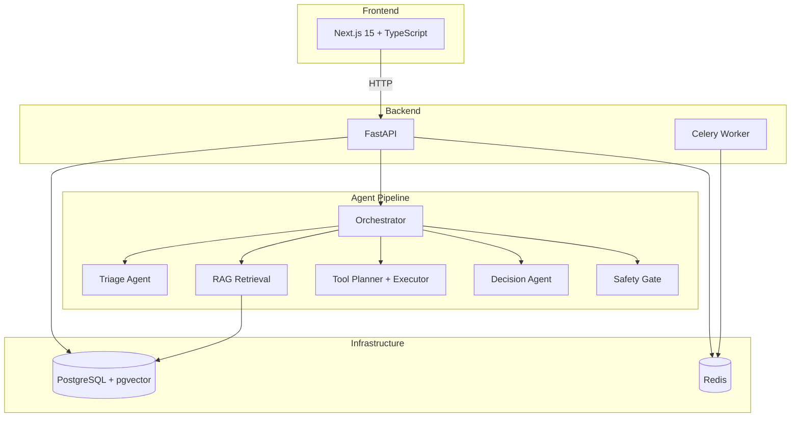

# LedgerDesk

[](https://github.com/KamalasankariS/LedgerDesk/actions/workflows/ci.yml)
[](https://www.python.org/downloads/)
[](https://nextjs.org/)
[](LICENSE)

**An agentic financial operations copilot for transaction exception handling, policy-grounded case resolution, and auditable workflow automation.**

<!-- Replace with your own recording: brew install --cask kap, record ~15s of the workflow -->
<!--  -->

---

## Overview

LedgerDesk is an internal platform for financial operations teams. It helps analysts handle transaction exceptions faster, more consistently, and more safely by combining:

- **Agentic AI workflows** that reason over context, retrieve evidence, call tools, and recommend actions
- **Retrieval-augmented generation** over internal policy documents and SOPs
- **Tool-orchestrated reasoning** against structured financial data (transactions, accounts, settlements, refunds)
- **Safety gates** with confidence thresholds, grounding checks, and human-in-the-loop review
- **Full audit trail** of every system action, tool call, prompt, and analyst decision

---

## Architecture



### Agent Workflow State Machine

```
created --> triaged --> context_retrieved --> tools_selected --> tools_executed
    --> recommendation_generated --> safety_checked --> awaiting_review
    --> approved --> completed
    --> rejected / escalated / failed_safe
```

---

## Features

### Case Management
- Ingest and create transaction exception cases
- Structured case details with financial context
- Priority-based queue with search and filtering

### Agent Workflow
- **Triage Agent** -- classifies issue type, extracts entities, assigns workflow path
- **Retrieval Agent** -- fetches relevant policy snippets and prior cases
- **Tool Planner** -- selects and prioritizes internal tool calls
- **Tool Executor** -- runs tools with typed JSON input/output
- **Decision Agent** -- generates grounded recommendations with citations
- **Safety Gate** -- validates confidence, grounding quality, and policy support

### Policy RAG
- Ingests internal policy documents (markdown)
- Chunks and indexes with pgvector embeddings
- Semantic retrieval with citation tracking
- Displayed alongside recommendations in the UI

### Mock Internal Tools
- `get_transaction_timeline` -- transaction history for an account
- `get_account_activity` -- account details and recent activity
- `get_settlement_status` -- settlement status lookup
- `get_refund_status` -- refund tracking by reference
- `search_similar_cases` -- prior case similarity search
- `get_merchant_reference` -- merchant information lookup

### Human Review
- Approve, reject, escalate, or edit recommendations
- Analyst notes and case annotations
- Status history tracking and reassignment support

### Audit Trail
- Every action logged with actor, timestamp, and trace ID
- Tool invocation records with latency and status
- Prompt version tracking and analyst override history

### Monitoring and Metrics
- Case throughput and status distribution
- Recommendation confidence distribution
- Tool call latency tracking
- Approval/override rates
- Health endpoints for all services

---

## Tech Stack

| Layer | Technology |
|-------|-----------|
| Frontend | Next.js 15, TypeScript, Tailwind CSS |
| Backend | FastAPI, Python 3.11, Pydantic |
| Database | PostgreSQL 16 + pgvector |
| Cache/Queue | Redis, Celery |
| ORM | SQLAlchemy 2.0, Alembic |
| LLM | OpenAI-compatible provider abstraction |
| Logging | structlog (structured JSON) |
| Containers | Docker, Docker Compose |
| CI/CD | GitHub Actions |

---

## Getting Started

### Prerequisites
- Docker and Docker Compose
- Node.js 20+
- Python 3.11+

### Quick Start

```bash
# Clone the repository
git clone https://github.com/KamalasankariS/LedgerDesk.git
cd LedgerDesk

# Copy environment config
cp .env.example .env

# Start infrastructure
make docker-up

# Setup backend
cd apps/api
python3 -m venv .venv
source .venv/bin/activate
pip install -r requirements.txt

# Run migrations and seed data
python -m app.seed

# Start API server
uvicorn app.main:app --reload --port 8000

# In another terminal, setup and start frontend
cd apps/web
npm install
npm run dev
```

Visit `http://localhost:3000` to access the dashboard.

### Docker (Full Stack)

```bash
docker compose up -d
```

---

## Demo Walkthrough

1. Open the LedgerDesk dashboard at `http://localhost:3000`
2. Navigate to **Case Queue** to see seeded exception cases
3. Open a case (e.g., "Suspected Duplicate Charge - Whole Foods")
4. Click **Run Workflow** to trigger the agent pipeline
5. Review the system recommendation, confidence score, and citations
6. **Approve**, **Reject**, or **Escalate** the recommendation
7. Add analyst notes for documentation
8. View the full **Audit Trail** for the case
9. Check **Metrics** for system performance

---

## Project Structure

```
LedgerDesk/
├── apps/
│   ├── api/                    # FastAPI backend
│   └── web/                    # Next.js frontend
├── packages/
│   ├── agent-core/             # State machine, orchestrator, LLM client
│   ├── retrieval/              # RAG pipeline (chunking, embedding, search)
│   └── evaluation/             # Evaluation harness
├── sample_data/                # Seed data
│   ├── cases/                  # Exception cases
│   ├── policies/               # Policy documents
│   ├── transactions/           # Transaction records
│   └── ...
├── docs/                       # Architecture and decisions
├── tests/                      # Integration and E2E tests
├── docker-compose.yml
├── Makefile
├── pyproject.toml
└── README.md
```

---

## Safety Model

LedgerDesk implements layered safety controls:

1. **Confidence thresholds** -- low-confidence recommendations require human review
2. **Grounding requirements** -- no recommendation without policy citation support
3. **Schema validation** -- all agent inputs/outputs validated against Pydantic schemas
4. **Bounded autonomy** -- agents operate within explicit state machine transitions
5. **Human-in-the-loop** -- sensitive actions always require analyst approval
6. **Audit logging** -- every system action is recorded and inspectable
7. **Fail-safe behavior** -- on failure, cases enter `failed_safe` state, never proceed unsupported

---

## Roadmap

### v1.1
- [ ] Full LLM-powered agent orchestration (LangGraph)
- [ ] Embedding-based policy retrieval
- [ ] Similar case search with vector similarity
- [ ] Real-time workflow progress updates (WebSocket)

### v1.2
- [ ] Multi-tenant workspace support
- [ ] Role-based access control
- [ ] Batch case processing
- [ ] Evaluation regression suite
- [ ] Performance dashboards with charts

### v2.0
- [ ] Write action support with approval workflows
- [ ] Slack/Teams integration for escalations
- [ ] Custom tool registration API
- [ ] Prompt versioning and A/B testing
- [ ] Production deployment guides

---

## Contributing

See [CONTRIBUTING.md](CONTRIBUTING.md) for development setup, code style, and testing guidelines.

## Security

See [SECURITY.md](SECURITY.md) for vulnerability reporting and security controls.

## License

[MIT](LICENSE)
